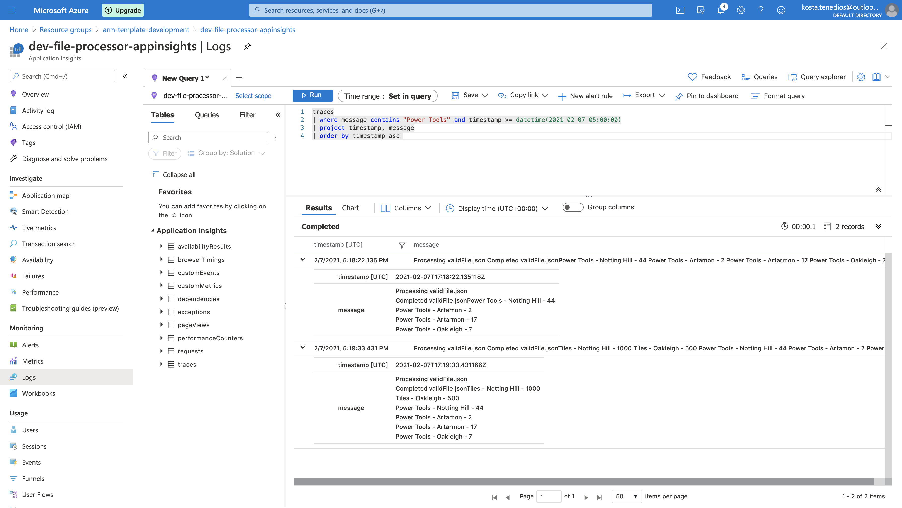

# Kosta DevOps Challenge

This is an implementation of the [DevOps Challenge 1](https://github.com/ettiennegous/devops-challenge-1) that aims to showcase the following:

* Set up of CI/CD pipelines.
* Provisioning of infrastructure and deployment of application stack in Azure using ARM templates and PowerShell scripts.
* Knowledge of SQL Server and T-SQL.
* Knowledge of C#, dependency injection and unit testing.

## Structure of repository

This repository consists of the following:

* `.github/workflows` - CI/CD pipelines implemented using GitHub Workflows
  * `file-processor.yml` - Builds a Docker image consisting of the compiled .NET Core 3.1 binaries for running the File Processor application (Azure WebJob), runs unit tests, and pushes the image to Azure Container Registry.
  * `provision-infrastructure.yml` - Provisions the required infrastructure in Azure for a given environment, and deploys the application stack to the target environment. Note that as of time of writing (Tuesday 9 February 2021), this workflow is failing. Refer to [this failed GitHub workflow run](https://github.com/ktenedios/devops-challenge-1/actions/runs/548107218).
* `infrastructure` - Contains ARM templates and scripts for provisioning infrastructure in Azure, and deploying the database to the SQL Server container running in Azure Container Instance.
* `src/file-processor` - Contains the source code of the .NET Core 3.1 application (File Processor), and is compiled as something that can be deployed to an Azure WebJob.

## Hosting environment in Azure

The following services make up the architecture in Azure that are used for running the warehouse solution:

* Storage account - Product Transmission files are to be uploaded to the `file-upload` container, which will then be picked up by the File Processor. Storage account also stores application logs and metrics that are then made available for reporting in Application Insights.
* Azure Container Instances
  * One container group runs a Docker container that hosts the File Processor Azure WebJob application. Warehouse reports generated by the application are output to the console (if running the container locally on your machine), and to Application Insights.
  * One container group runs a Docker container that hosts SQL Server.
* Application Insights - Not only used as the APM solution, but also is used for pulling out the [warehouse reports](https://github.com/ettiennegous/devops-challenge-1#sample-output). For an example:

